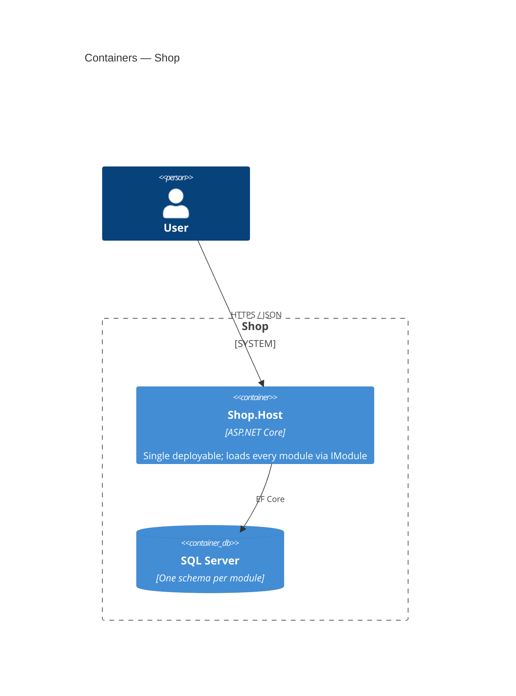

# C4 — Containers

```mermaid
C4Container
  title Containers — Shop
  Person(user, "User")
  System_Boundary(sys, "Shop") {
    Container(host, "Shop.Host", "ASP.NET Core", "Single deployable; loads every module via IModule")
    ContainerDb(db, "SQL Server", "One schema per module")
  }
  Rel(user, host, "HTTPS / JSON")
  Rel(host, db, "EF Core")
```

Modules inside the host are listed in [modules/README.md](modules/README.md).
