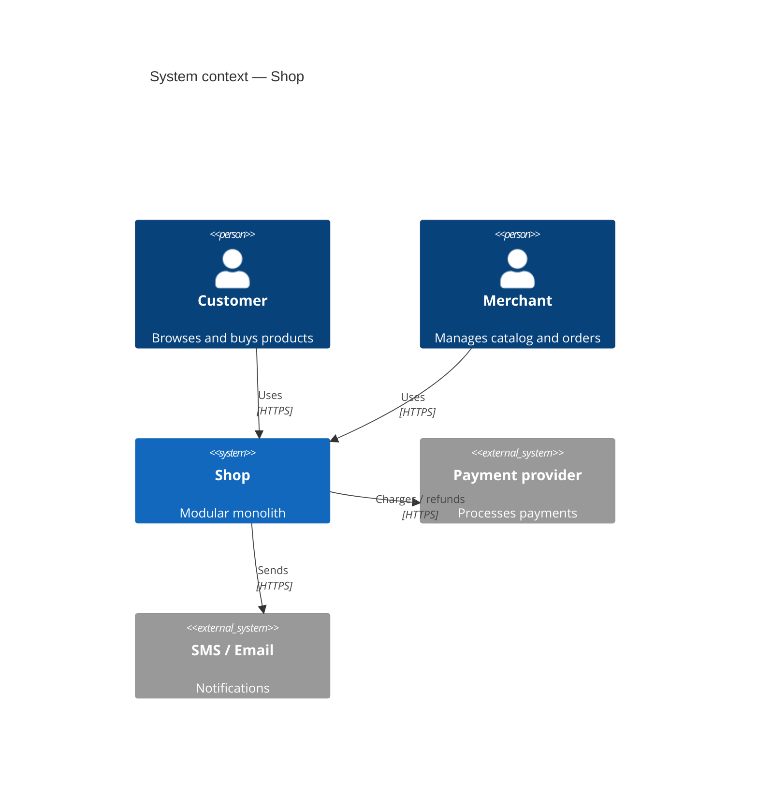

# C4 — System context

```mermaid
C4Context
  title System context — Shop
  Person(customer, "Customer", "Browses and buys products")
  Person(merchant, "Merchant", "Manages catalog and orders")
  System(platform, "Shop", "Modular monolith")
  System_Ext(psp, "Payment provider", "Processes payments")
  System_Ext(notify, "SMS / Email", "Notifications")

  Rel(customer, platform, "Uses", "HTTPS")
  Rel(merchant, platform, "Uses", "HTTPS")
  Rel(platform, psp, "Charges / refunds", "HTTPS")
  Rel(platform, notify, "Sends", "HTTPS")
```
