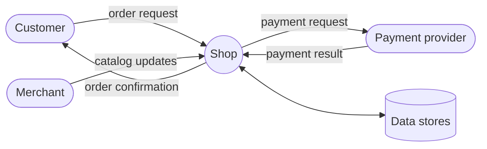

# DFD — Level 0

```mermaid
flowchart LR
  Customer([Customer]) -- order request --> P((Shop))
  P -- order confirmation --> Customer
  Merchant([Merchant]) -- catalog updates --> P
  P -- payment request --> PSP([Payment provider])
  PSP -- payment result --> P
  P <--> DS[(Data stores)]
```
